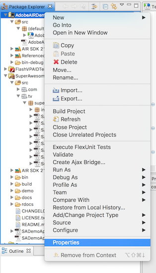
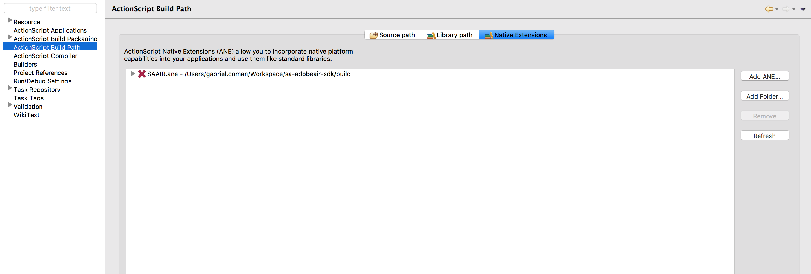

Integrate the SDK
=================

The SuperAwesome Adobe AIR SDK, as of version 3.1.6, is built as an AIR Native Extension in order to work together
with the SuperAwesome Android or iOS SDK.
This in turn allows you to harness the full power of native components, such as video based on AVFoundation / VideoView technology,
proper WebViews, better fullscreen experience, etc.

**Note:** This document assumes:

* a Flash Builder ActionScript Mobile Project named **AdobeAIRDemo**,
* containing a single .as file, called **AdobeAIRDemo.as**, that acts as main class.

To begin integrating the SDK download the latest version of the `SAAIR.ane <https://github.com/SuperAwesomeLTD/sa-adobeair-sdk-docs/raw/master/source/res/SAAIR.ane>`_
file, then right-click on your project in the *Package Explorer* and select *Properties* :

Then go to *ActionScript Build Path* and then to the *Native Extensions* tab.

Lastly you'll want to add the .ane file you just downloaded by clicking on the *Add ANE* button.

If you follow all these steps the SuperAwesome AIR SDK will be installed as a Native Extension.
There are however a couple of additional steps to do for either the Android or iOS build.

Setup for Android builds
^^^^^^^^^^^^^^^^^^^^^^^^

When building your Adobe AIR app as an Android application, you'll often want to change the associated XML file that AIR generates
alongside your project to add or change different parameters to make it suitable for deploying on Android.
Using the SuperAwesome AIR SDK is no exception, and you'll have to add the following lines to the
Android / Manifest Additions part of the xml file.

.. code-block:: xml

    <android>
    <manifestAdditions><![CDATA[
        <manifest android:installLocation="auto">
            <uses-permission android:name="android.permission.ACCESS_NETWORK_STATE"/>
            <uses-permission android:name="android.permission.ACCESS_WIFI_STATE"/>
            <uses-permission android:name="android.permission.INTERNET"/>
            <application android:allowBackup="true">
                <activity android:name="tv.superawesome.sdk.views.SAInterstitialActivity$SAInterstitialActivityInner"
                          android:label="SAInterstitialActivity"
                          android:theme="@android:style/Theme.Black.NoTitleBar.Fullscreen"
                          android:configChanges="keyboardHidden|orientation|screenSize"></activity>
                <activity android:name="tv.superawesome.sdk.views.SAVideoActivity$SAVideoActivityInner"
                          android:label="SAVideoActivity"
                          android:theme="@android:style/Theme.Black.NoTitleBar.Fullscreen"></activity>
                <service android:name="tv.superawesome.lib.sautils.SAAsyncTask$SAAsync" android:exported="false"/>
                <meta-data android:name="com.google.android.gms.version" android:value="8.4.0"/>
            </application>
        </manifest>
    ]]></manifestAdditions>
    <containsVideo>true</containsVideo>
    </android>

As you can see this adds some new permissions the SDK needs (access to Internet) and also adds two activities (SAInterstitialActivity and SAVideoActivity)
and a new service (SAAsyncTask).

Setup for iOS builds
^^^^^^^^^^^^^^^^^^^^

This feature is not yet available, but will be soon.
