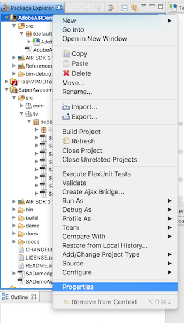
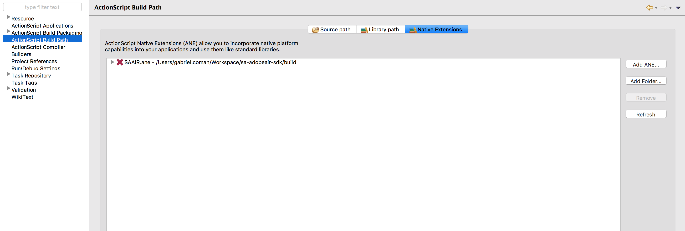

Add the SDK
===========

The SuperAwesome Adobe AIR SDK is built as an AIR Native Extension in order to work together
with the SuperAwesome Android or iOS SDK.
This in turn allows you to harness the full power of native components, such as video based on AVFoundation / VideoView technology,
proper WebViews and a better fullscreen experience.

To begin integrating the SDK:

1.1) Download the latest version of the full SuperAwesome AIR SDK: `SuperAwesomeSDK-<sdk_version>.AdobeAIR.full.ane <https://github.com/SuperAwesomeLTD/sa-sdk-build-repo/blob/master/package/aa_air/<sdk_version>/SuperAwesomeSDK-<sdk_version>.AdobeAIR.full.ane?raw=true>`_ .
The **full** version will contain everything you need in order to load and display banner, interstitial and video ads as well as the 3rd party `Moat Analytics <https://moat.com/analytics>`_ module.

1.2) Or download the laster version of the base SuperAwesome AIR SDK: `SuperAwesomeSDK-<sdk_version>.AdobeAIR.base.ane <https://github.com/SuperAwesomeLTD/sa-sdk-build-repo/blob/master/package/aa_air/<sdk_version>/SuperAwesomeSDK-<sdk_version>.AdobeAIR.base.ane?raw=true>`_ .
This has the same functionality as the full version, but lacks the Moat Analytics module.

2) Right-click on your project in the *Package Explorer* and select *Properties* :

3) Then go to *ActionScript Build Path* and then to the *Native Extensions* tab.

4) Lastly you'll want to add the .ane file you just downloaded by clicking on the *Add ANE* button.

If you follow all these steps the SuperAwesome AIR SDK will be installed as a Native Extension.
There are however a couple of additional steps to do for either the Android or iOS build.

Setup for Android builds
------------------------

When building your Adobe AIR app as an Android application, you'll often want to change the associated XML file that AIR generates
alongside your project to add or change different parameters to make it suitable for deploying on Android.
Using the SuperAwesome AIR SDK is no exception, and you'll have to add the following lines to the
Android / Manifest Additions part of the xml file.

.. code-block:: xml

    <android>
    <manifestAdditions><![CDATA[
        <manifest android:installLocation="auto">
            <uses-permission android:name="android.permission.ACCESS_NETWORK_STATE"/>
            <uses-permission android:name="android.permission.INTERNET"/>
            <application android:allowBackup="true">

                <activity android:name="tv.superawesome.sdk.views.SAInterstitialAd"
                          android:label="SAInterstitialAd"
                          android:theme="@android:style/Theme.Black.NoTitleBar.Fullscreen"
                          android:configChanges="keyboardHidden|orientation|screenSize"></activity>

                <activity android:name="tv.superawesome.sdk.views.SAVideoAd"
                          android:label="SAVideoAd"
                          android:theme="@android:style/Theme.Black.NoTitleBar.Fullscreen"></activity>

								<activity android:name="tv.superawesome.sdk.views.SAAppWall"
													android:label="SAAppWall"
													android:theme="@android:style/Theme.Black.NoTitleBar.Fullscreen"
													android:configChanges="keyboardHidden|orientation|screenSize"></activity>

                <service android:name="tv.superawesome.lib.sanetwork.asynctask.SAAsyncTask$SAAsync" android:exported="false"/>

                <receiver android:name="tv.superawesome.sdk.cpi.SACPI" android:exported="true">
                    <intent-filter><action android:name="com.android.vending.INSTALL_REFERRER"/></intent-filter>
                </receiver>

            </application>
        </manifest>
    ]]></manifestAdditions>
    <containsVideo>true</containsVideo>
    </android>

Setup for iOS builds
--------------------

There are no additional steps to take when it comes to the iOS build, but you must know that the native component of the SDK will only work for **iOS 8.0+** builds.

Finally
-------

Once you've integrated the SuperAwesome SDK, you can access all functionality by including following:

.. code-block:: actionscript

    import tv.superawesome.*;
